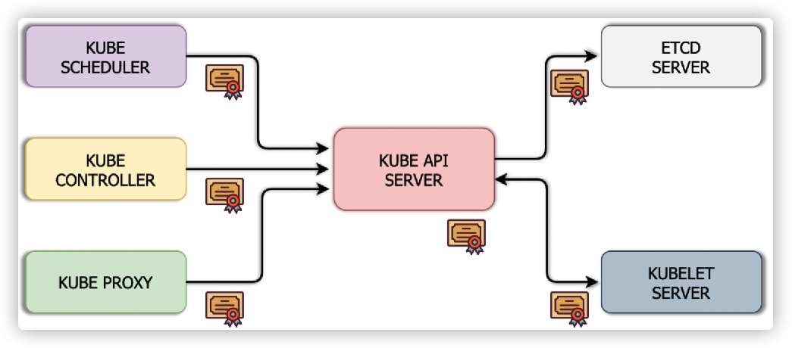
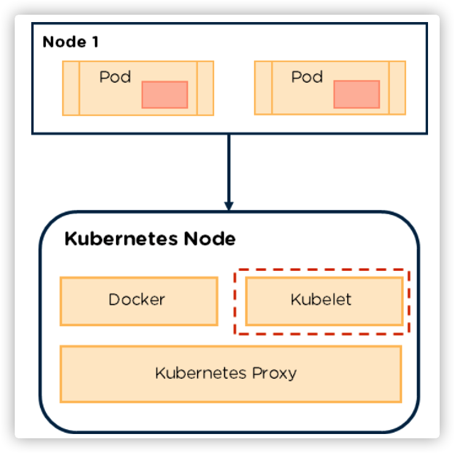
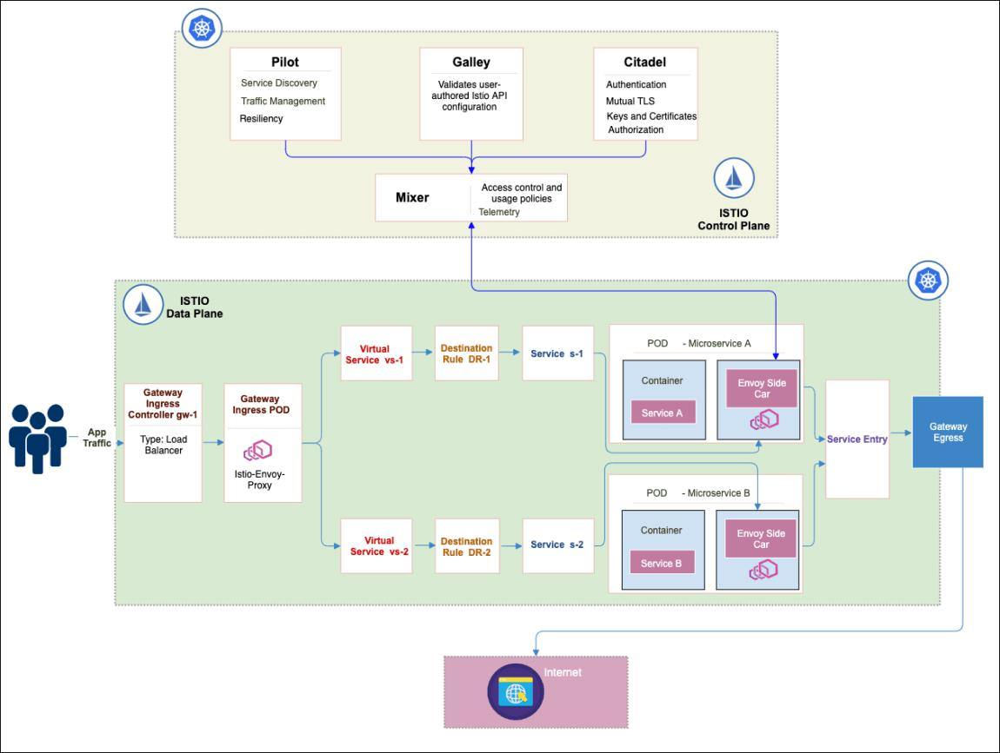
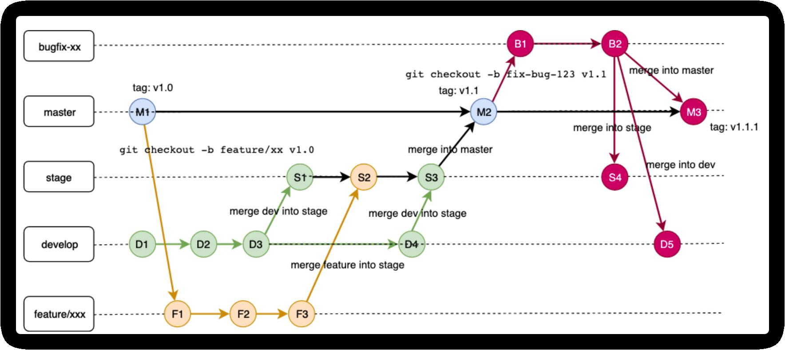
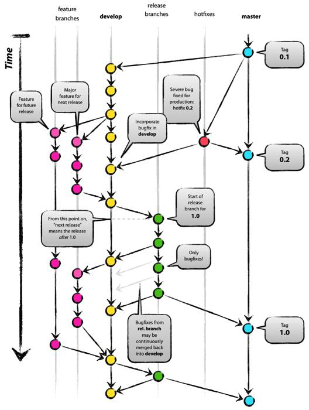
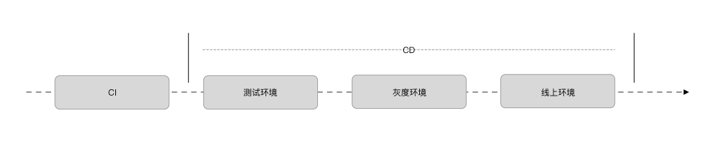
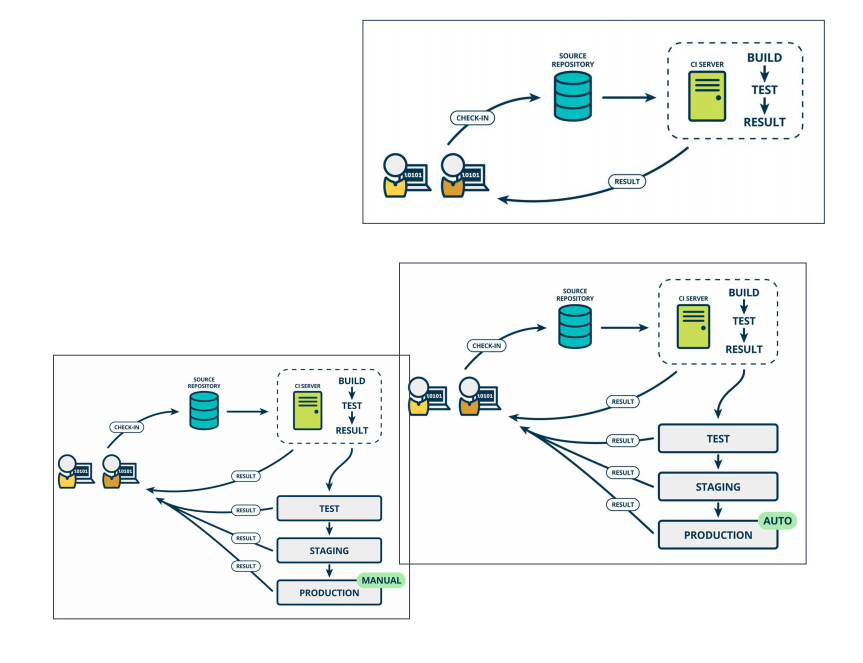
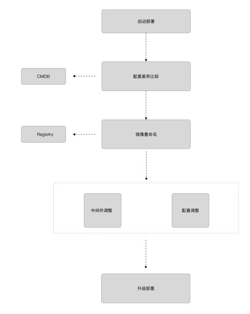
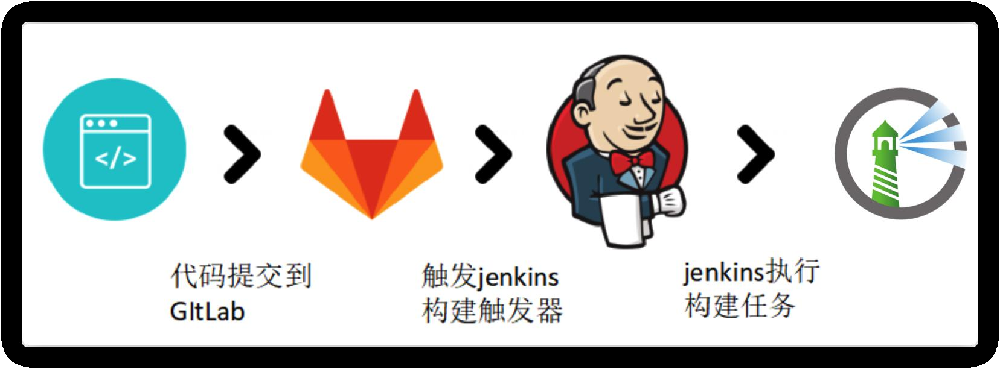

**图片太多了，不传图床了；下载到本地后就能正常显示~**

# 联系我

- E-Mail：dtsola@163.com
- QQ：550182738

# Cloud Native

## 概念
云原生是一套技术体系和方法论，是一种构建和运行应用程序的方法。云原生（Cloudnative）是一个组合词，Cloud表示应用程序位于云中，Native表示应用程序运行在云上，突破了数据中心的束缚，充分发挥和利用云平台的弹性与分布式优势，以最佳姿势运行。云原生包含微服务、容器化、DevOps和持续交互四要素。

- 微服务：
  几乎每个云原生的定义都包含微服务，跟微服务相对的是单体应用，微服务有理论基础，那就是康威定律，指导服务怎么切分，很玄乎，凡是能称为理论定律的都简单明白不了，不然就忒没b格，大概意思是组织架构决定产品形态，不知道跟马克思的生产关系影响生产力有无关系。

- 容器化：
  Docker是应用最为广泛的容器引擎，在思科谷歌等公司的基础设施中大量使用，是基于LXC技术搞的，容器化为微服务提供实施保障，起到应用隔离作用，K8S是容器编排系统，用于容器管理，容器间的负载均衡，谷歌搞的，Docker和K8S都采用Go编写，都是好东西。

- DevOps：
  这是个组合词，Dev+Ops，就是开发和运维合体，不像开发和产品，经常刀刃相见，实际上DevOps应该还包括测试，DevOps是一个敏捷思维，是一个沟通文化，也是组织形式，为云原生提供持续交付能力。

- 持续交付：
  持续交付是不误时开发，不停机更新，小步快跑，反传统瀑布式开发模型，这要求开发版本和稳定版本并存，其实需要很多流程和工具支撑。

  

## 容器化
### 概念
  - 什么是容器：让你看到想让你看到，不让你看到不想让你看到的 ---障眼法

### 痛点
  - 机器成本高
  - 资源利用率低

### 解决方案
  - PAAS
      - 虚拟机
      - 应用托管
  - docker

### docker架构

- 组件
  - Docker 镜像
  - Docker 容器
  - Docker 守护进程
  - Docker 客户端
  - Docker 仓库
  - Docker Hub

### 技术原理

#### 沙盒

##### namespace

- 

- 边界/隔离
  - Pid
  - net
  - ipc
  - mnt
  - uts
  - User
- 缺陷
  - 共享内核
  - 隔离不彻底

##### cgroups

- 
- 限制资源
  - cpuset
    - 为进程分配单独的 CPU 核和对应的内存节点
  - cpu
    - 为进程设定CPU使用的限制
  - memory
    - 为进程设定内存使用的限制
  - blkio
    - 为 块 设 备 设 定 I/O 限 制，一般用于磁盘等设备

#### 联合文件系统

- 文件联合
- 顶层可写
- 其它层只读
- Docker 镜像分层机制
  - 一个 Image 是通过一个 DockerFile 定义的，然后使用 docker build 命令构建它。DockerFile 中的每一条命令的执行结果都会成为 Image 中的一个 Layer
  - Docker 通过 AUFS 来管理 Images。所以 Layer 和 Image 的关系与 AUFS 中的联合目录和挂载点的关系比较相似
- Dockerfile 
  - 保持简洁
  - 剃刀原则
  - 最好只运行一个进程
  - 保持可读性

### 优势

- 优点
  - 方便的客户端工具
  - 稳定的服务端
  - 统一的镜像打包
  - 无敌的镜像仓库
  - 生态系统
- 缺点
  - 内核共享
  - 资源隔离
  - 安全性
  - 性能损耗
  - 数据存储
- 适用场景
  - SAAS环境
  - CI/CD
  - 应用隔离

## 容器编排

### k8s架构

- 服务编排
- 流量编排 - 未能完全满足用户需求 ☆ -- 服务网格或自行实现流量治理
- 存储编排

### 组件

#### 主要组件
##### etcd
  - 
  - 强一致性
  - 高可用
  - 性能优先
  - 支持Watch
##### kube-apiserver 
  - 
  - 集群资源操作的唯一入口 
  - 认证
  - 授权
  - 访问控制
  - API 注册和发现 
##### kube-controller-manager
  - 
  - 确保集群中各种资源的实际状态与用户期望状态一致
##### kube-scheduler
  - 
  - 
  - 负责资源的调度，按照预定的调度策略将 Pod 调度到相应的机器上
##### kubelet
  - 
  - 控制Pod生命周期
  - 控制CSI生命周期
  - 负责CNI创建和访问规则
##### Container runtime
  - 
  - Docker
  - Rkt
  - ContainerD
  - CRI-O
##### kube-proxy
  - 
  - 节点运行的负责创建Pod网络访问规则的工具
    - 用户态处理
    - Iptables
    - IPVS(eBPF-ipvs)

#### 非核心组件
##### kube-dns

 

    - my-svc.namespace.svc.cluster.local
      - Service 解析为Cluster IP 
      - Headless Service 解析为Pod IP列表 
##### Ingress Controller

    - 负责南北向流量
    - 自动将域名+接口与Service ClusterIP进行绑定
##### Dashboard

    
    - Kubernetes Dashboard
    - KubeBoard 
    - Rancher 
    - Lens 
##### Federation

    - 管理多集群资源
    - 分散工作负载 
    - 跨集群资源编排
    - 迁移应用 
    - 跨集群服务发现
    - 多云管理

### 设计理念

- 分层架构
  - 插件层 -- 生态系统
  - 接口层 -- kubectl 命令行工具、客户端 SDK 以及集群联邦
  - 管理层 -- 系统度量、自动化和策略管理
  - 应用层 -- 部署和路由
  - 核心层 -- 对外提供 API 构建高层的应用，对内提供插件式应用执行环境

### 设计原则

#### API设计原则

  - 声明式API
  - 资源组合可复用
  - 高阶API以调度编排为设计基础
  - 低层API根据高阶API需求而设计
  - 封装适度
  - 不依赖网络状态的状态
  - 慎用全局变量

#### 控制机制设计原则

  - 完善的容错设计
  - 简单状态机
  - 支持自愈
  - 支持降级

#### 架构设计原则

  - 只有API Server才可以访问etcd
  - 单点故障不影响使用
  - 支持自愈后的幂等性
  - 支持服务内缓存
  - 使用监听而非轮询

#### 引导（Bootstrapping）原则

  - 具备自维护性
  - 减少依赖，通过分层管理依赖
  - 状态支持重放
  - 支持状态切换
  - 自我监控

### 技术栈

#### 应用定义及部署
  - https://kubernetes.io/docs/reference/generated/kubernetes-api/v1.22/
  - 
  - 
  - 
#### 编排与管理
  - 一致性与服务发现
    - 
  - 南北流量
    - 
  - 远程调用服务
    - 
  - API网关
    - 
  - 服务网格
    - 
#### 运行环境
  - 云原生存储
    - 
  - 云原生网络
    - 
    - 
  - 容器运行时
    - 
#### 配置
  - 容器注册
    - 
  - 权限管理  RBAC
  - 密钥管理
  - 参数管理
#### 可观测性和分析
  - 监控
    - 
  - 日志
    - 

### 资源对象

#### Pod
  - 
  - Kubernetes 中创建和管理的、最小的可部署的计算单元
  - 一组（一个或多个） 容器
  - 共享存储、网络、以及容器声明
  - ServiceAccount ☆
    - 解决 Pod 在集群中的身份认证
    - 每个namespace存在default的SA
#### Deployment
  - 万能的部署
  - 
  - 
  - 通过管理ReplicaSet来间接管理Pod
  - 滚动更新、回滚以及支持副本的水平扩容
#### Daemonset
  - 节点守护
  - 所有节点上提供基础服务和守护进程
    - 运行在每个Node之上
    - 每个节点只有一个Pod
    - 新节点会自动创建，节点移除时会自动清理
  - 使用DaemonSet的场景
    - 网络插件
    - 日志组件
    - 监控组件
    - 存储组件
    - 网关组件(特定场景)
#### StatefulSet
  - 状态保持器
  - 无状态服务和有状态服务
    - 
    - 服务产生的数据都要落地做持久化
    - 持久化可以选择本地或者外部
#### Job/CronJob
  - 有始有终
  - 
#### Service
  - 内部的高速路
  - 
  - 为提供相同功能服务的一组Pod建立的网络抽象
  - 每一个Service都是一组Pod的逻辑集合和访问方式的抽象

#### Ingress
  - 边境口岸
  - 
  - 将内部服务暴露到集群外部
      - 一个负责生成对外网络访问的Controller
      - 将请求重定向到集群内部
      - 核心仍然是反向代理
#### PV/PVC
  - PV 的定义
      - 具体的存储实现
      - 供应方式
          - 
          - 静态供应
          - 动态供应
    - 集群级别的资源
    - 生命周期独立于Pod，保存了存储设备的详细信息
- PVC 的特性
  - 对PV的需求声明
  - 每次的PVC都会消耗库存的PV
  - 等待合适的PV，并与PV进行1v1的绑定
  - 解决耦合的问题

## 微服务
### 概念

微服务（Microservice）是一种架构方案，用于构建应用服务，微服务可以单体架构将应用服务拆分为多个核心功能，每项服务对应一个功能。

- 高度可维护和可测试
- 松散耦合的
- 独立部署
- 围绕业务能力组织
- 属于一个小团队

### 痛点

- 
- 链路跟踪
- 快速扩缩容
- 资源限制
- 部署复杂度

### 解决方案

#### 容器化

- 环境一致性
- 快速伸缩容

#### CI

- 
- Dockerfile
  - 开发维护，跟随代码
  - Devops维护，单独仓库
- 镜像仓库

#### CD

##### 服务编排

- 
- Swarm
- Fleet
- k8s

##### 注册中心

- 
- 4层注册
- 7层注册

##### 监控

- 
- 主动上报
- 被动拉取

##### 日志

- 
- 标准输出
- 文件落地

## 服务网格
### 概念

- 服务网格是一个基础设施层，用于处理服务间通信。

- 服务网格重点关注的问题是保证请求可以正确处理。

- 服务网格通常是由轻量级的网络代理组成的，并且与应用 

  程序部署在一起，但对应用程序透明。

### 架构

### 服务发展

#### 单体架构

- 需求
  - 快速开发上线
- 优势
  - 独立开发
  - 快速上线
- 弊端
  - 强耦合

#### 服务化改造

- 拆分原则
  - 按业务纬度拆分
  - 按服务纬度拆分
- 弊端
  - 服务间调用

#### 微服务

- 协议特点
  - HTTP
    - 明文协议，开发调试比较方便
    - 臃肿
  - RPC
    - 需要调研多种RPC框架
    - 可编程
- 结论
  - 服务规模小使用HTTP，服务规模大使用RPC

#### 容器化

- 优势
  - 利用Kubernetes的动态伸缩容特性
  - 服务编排
- 弊端
  - 释放了语言天性
  - 流控
  - 链路跟踪

#### ServiceMesh

- 第一代
  - SideCar 模式
- 第二代
  - CP+DP -- 控制面板+数据面板

### 解决了哪些问题

- ServiceMesh的本质是针对东西向流量的解析和处理
- 在流量解析和处理之上，衍生了安全认证、负载均衡、流量调度、数据采集和分析等功能
- Kubernetes管理服务生命周期，服务网格则提供流量编排的能力

#### 试图解决的问题

- 消除内嵌SDK
- 强化通信配置
- 提供主动/被动服务检测
- 提供可观察性

#### ServiceMesh 结构

- 处理东西向流量
- 数据中心内部流量
- 网关
  - 南北流量
  - 集群外部流量

#### ServiceMesh 能力

- 连接性
  - 流量控制
  - 网关
  - 服务发现
  - A/B 测试、金丝雀
  - 服务超时、重试
- 可靠性
  - 断路器
  - 故障注入 / 混沌测试
- 安全性
  - 服务间认证（mTLS）
  - 证书管理
  - 用户认证（JWT）
  - 用户授权（RBAC）
  - 加密
- 可观察性
  - 监测
  - 遥测、仪表、计量
  - 分布式追踪
  - 服务图表

### ISTIO

#### 架构

#### Istio额外的功能

- 支持多种流量自动负载
- 细粒度的流量控制
- 对流量进行自动化度量、日志记录和追踪
- 提供额外的服务间安全通信

#### Istio 组件

- Istio CP用于准备数据，DP用于解析和处理流量数据，DP中会通过init初始化挟持规则，将所有流量导入到envoy中进行处理，envoy采取筛选器机制，对不同的流量进行定制化处理。

- CP
  - istiod
- DP
  - istio-init
  - istio-agent
  - envoy

##### Istio 组件 - CP

- 为转发数据包准备配置数据
- Pilot
  - 管理和配置所有DP代理实例
  - 管理DP之间路由流量规则
    - 规则DSL语言
  - 配置故障恢复
- Galley
  - 管理和配置所有DP代理实例
- Citadel
  - 安全认证
  - 负责密钥和证书管理
  - 分发安全配置
  - 客户端和服务端的安全通信
  - 管理遥测和审计

##### Istio 组件 - DP

- 负责高速地处理和转发数据包
- 服务发现
- 健康检测
- 流量路由
- 负载均衡
- 身份验证和授权
- 链路追踪
- proxy containers
  - Istio-init
    - 初始化网络和iptable 规则
  - Pilot-agent
    - 同步管理数据
    - 启动代理服务进程
    - 统计并上报遥测数据
  - Envoy
    - 流控
    - 生成遥测数据
    - 文件配置
    - API配置(XDS) -- XDS协议
    - 使用流程
      - 通过pilot-agent初始化xDS server位置
      - envoy通过xDS获取listener、cluster， route配置
      - envoy启动Listener，进行流量管理

#### Istio到底好不好

- Istio目前能提供的功能和场景有限，性能是最大的阻碍
- 应用迁移到Istio，需要做适配和修改。这种适配一旦完成，将无法回退

##### 适用场景

- 灰度发布
- 流量管理
- 链路可视化

##### 目前存在的问题

- 应用透明
  - SDK需要移除或者修改适配
- 非容器化不友好
  - 网络需要改造
  - 需要定制路由组件
- 支持有限的协议
  - 可能需要自研Plugin
- 高并发时的性能问题
  - 多次解封包造成性能损耗
  - 消耗的资源成倍增加
- 缺乏成熟的容灾方案
  - sidecar崩溃后，网络就会崩溃
- 支持的场景有限
  - 仅限于服务间调用

##### 选择Istio需要考虑的因素

- 服务是否都托管到Kubernetes之上
- 服务是否全部是Http协议
- 服务可视化是否是当前最大的痛点
- 是否可以接受Istio带来的资源成本

## Serverless

- Serverless分为Faas和Baas
- Serverless使用了大部分云原生的技术栈，使用Serverless的过程就是熟悉云原生的过程
- Serverless对于Devops和业务开发都有意义

### 概念

- 无须关心服务端的一种开发范式
- 将服务端作为一种资源对外暴露出来
- 对于业务开发来说
  - 服务端免运维
  - 函数即服务
  - 意义
    - 降低开发成本
    - 精力聚焦于业务逻辑
    - 不需要关系环境稳定因素
- 对于Devops开发来说
  - 细粒度的资源编排调度方案
  - 基于事件驱动的函数计算
  - 意义
    - 云原生开发的入门课程
    - 有助于了解云原生整体技术栈
    - 掌握云原生运维体系

###  Faas和Baas

- Faas
  - 
  - 事件驱动
  - 函数计算
  - 轻、快、无状态
- Baas
  - 
  - 业务即服务
  - 后端、免运维、Faas的支撑
  - 固定、有状态

### 解决什么场景

- 降低运行成本
- 高冗余的备份/容灾机制
- 降低长尾产品运维成本
- 提高服务迭代效率

### 开源框架

#### 公有云厂商的Serverless服务

- Lambda
- Azure Function
- Serverless Cloud Function
- Cloud Functions
- Function Graph

#### Serverless和云计算的区别

- 解耦计算和存储
- 代码编排而非资源编排
- 为资源付费

#### 开源Serverless

- Serverless
- OpenFaaS
- Kubeless
- OpenWhisk
- Knative
- Fission
- Fn
- Nuclio

#### 不同开源框架区别

- 开发语言
- 技术栈
- 易用性
- 文档

## CI/CD
### 什么是CI/CD

- CI/CD最关键的内容就是痛苦的事情反复做
- CI是实施标准化和构建CMDB的好时机
- CD分为持续交付和持续部署，两者侧重点和自动化程度不同

#### 极限编程
  - 如果集成是重要的，那么一天中应该多次集成并测试。
  - 如果测试是重要的，那么应该始终进行测试。
  - 如果设计是重要的，那么应该把它当做日常事务的一 部分。
  - 如果迭代越短越好，那么迭代时间应该非常短，秒、 分钟或小时，而不是周、月或年。
  - CI
      - 持续集成，属于开发人员的自动化流程
  - CD
      - 持续交付/持续部署

#### CI/CD的作用

- CI

  - 
  - 定期构建代码变更
  - 测试并合并新的代码到公共代码库中

- CD

  - 持续交付

    - 
    - 自动进行代码变更的测试并进行合并工作
    - 运维团队将代码变更部署到线上环境
    - 确保尽可能减少部署新代码时所需的工作量

  - 持续部署

    - 
    - 自动将代码从存储库发布到生产环境
    - 解决手动工作效率低的问题

#### CI/CD的关系

- 持续集成
  - 从编码到构建再到测试的反复持续过程
- 持续交付
  - “持续集成”之后，持续反复的将代码变更应用到某个环境
- 持续部署
  - 持续交付的最后一公里，快速且安全地将代码变更交付到线上

#### 如何实现CI/CD

- 自动化流程/管道
- 标准化
- 难点
  - 业务标准化
  - 持续自动化
  - 持续监控
- 实现
  - 先做CI
  - 再实现交付和部署

### CI实现的原理和难点

- CI需要解决的痛点是手工合并过程繁琐并且容易出错
- CI需要从配置、环境和构建管理三个方面入手解决痛点
- 需要体现Devops工程师的价值

#### 当前痛点

- 多分之开发造成合并困难
- 手动合并繁琐、耗时
- 基于本地IDE开发，容易出现冲突

#### 解决痛点

- 频繁的进行代码合并
- 自动化测试
  - 单元测试
  - 集成测试
- 快速发现代码冲突和质量问题

#### 实施CI的难点

- 组织文化
  - 跨部门/跨团队协作
  - 主观能动性，跳出舒适区
  - 甩锅

- 系统架构
  - 单体应用需要拆分
  - 服务化需要引入分支管理
  - 微服务需要考虑服务依赖

#### 实施CI的步骤

- 配置管理
- 环境管理
- 测试管理

##### 实施CI的步骤 - 配置管理

- 代码分支策略
  - 
  - TBD
  - Git Flow
  - GitHub Flow
  - GitLab Flow
- 如何管理依赖包
  - 脚本型语言
  - 编译型语言
  - 依赖管理的原则
- 代码冲突如何解决
  - 阻塞处理
  - 回滚处理
- 功能冲突如何解决
  - 业务开关
  - 业务取舍

##### 实施CI的步骤 – 构建管理

- 构建前
  - 静态代码检查
- 构建中
  - 依赖管理
  - 构建环境管理
  - 交付物管理
- 构建后
  - 一次构建四处部署

##### 实施CI的步骤 - 环境管理

- 需要多少测试环境
  - 够用就好
- 测试环境
  - 主要用户
  - 用户关注点

#### CI的价值

- 显性价值
  - 构建速度
  - 合并速度
  - 开发速度
- 隐形价值
  - 业务指标 (收入、日活、GMV)

### CD实现的原理和难点

#### 持续交付-目标

- 拥有一个可随时部署到生产环境的代码库
- 提交的每一个修订都会触发一个自动化流程，即构建、测试并提供更新

#### 持续交付-优势

- 自动化软件发布流程
- 提高开发人员的工作效率
- 更快发现并解决缺陷
- 更快交付更新

#### 持续交付-特点

- 构建并多维度测试代码变更，并处于部署就绪状态
- 手动推送到线上环境 ☆

#### 持续交付-原则

- 自动化
- 一直在测试
- 小步快跑
- 存在明确并唯一的代码基准线
- PR

#### 持续交付-实施

- 配置管理
- 敏捷测试
- 流水线

##### 持续交付-配置管理

- 所有配置和动作全部纳入版本管理
- 存在全局唯一的配置中心 (CMDB)
- 自动化流转

##### 持续交付-敏捷测试

- 工程
  - 单元测试、功能测试，系统测试
- 部署
  - 容量测试、可用性测试

##### 持续交付-流水线

- 从开发、测试到予发布
- 关联CMDB
- 对开发及部署过程进行建模

#### 持续交付-衡量指标

- 验证目标
  - 服务是不是一直处于可发布状态
- 指标
  - 关注团队交付时间，不需要过多关注个人交付时间

#### 持续部署

- 持续部署是持续交付的最后阶段，是持续交付的延伸。
- 持续部署全部操作都应该是自动化的，不应该存在手工操作的可能性。
- 对于持续部署来说，自动化监控体系非常重要。

- 持续交付的最后阶段，是持续交付的延伸
- 自动化推送到线上环境

##### 持续部署-目标

- 自动将应用发布到生产环境

##### 持续部署-原则

- 小步快跑

##### 持续部署-难点

- 自动化测试
- 自动化监控
- 自动化流程

##### 持续部署-实施

- 必须存在一个可以运行的持续交付
- 配置管理
- 发布自动化
- 基础架构监控

###### 持续部署-配置管理

- 无侵入的环境配置
- 无侵入的网络变更

###### 持续部署-发布自动化

- 非容器化
- 容器化
  - kubernetes集群
  - 多云部署

###### 持续部署-基础架构监控 

- 技术指标
  - 服务响应
  - 响应时长
  - 集群资源
- 业务指标
  - 用户侧请求时长
  - 用户侧崩溃率

### 如何实现CI

- CI有5个阶段，并且都会使用到CMDB。
- 在CI过程中，测试非常重要，而且也是很容易被忽视的一个环节
- 根据业务场景和关注点来决定开源还是自研

#### CI原理和难点

- CI是一种团队文化，技术并不是难点，文化认同是最重要的
- CI实施过程分为三个阶段和七个难点

##### 什么是CI

- 持续集成是极限编程的一种实践
- 自动化编译和自动化测试

##### CI的目标

- 触发构建和相对应的自动化测试
- 验证代码变更是预期的，并确保变更没有破坏其他逻辑

##### CI的好处

- 快速发现问题
- 避免集中构建造成的混乱
- 避免大范围的故障造成回滚
- 快速迭代，保质保量

##### CI的三个阶段

###### 触发流水线

- 集成规则
- 分支策略

###### 触发自动化测试

- 测试的时效性
- 测试的准确性
- 测试环境的稳定性

###### 快速修复

- 文化的认同

##### 做好一个CI有哪些困难

- 开发/devops工程师职责范围
- 标准化
- CMDB
- 代码可追溯
- 自动化
- 确定测试范围
- 客户端和服务端构建方式不同

#### CMDB

- CMDB分为广义和狭义两类，广义以应用和服务树为核心
- CMDB有三种资源视角，针对三种不同的场景 
- CMDB是所有标准化和自动化的基础。

- 以应用为核心的配置数据库
- 应用的360视图

##### CMDB的分类

- 广义
- 狭义

###### 狭义的CMDB

- 硬件资源
- 很少变更
- 人工维护

###### 广义的CMDB

- 应用
  - 配置视角
    - 
    - owner
    - git仓库
    - 语言类型
    - 启动/运行脚本
  - 资源视角
    - 
    - 启动/运行参数
    - 域名信息
    - 中间件资源
    - 服务依赖
  - 部署视角
    - 
    - 版本信息
    - 集群信息
    - 镜像信息
    - 负载信息
    - 灰度/金丝雀信息
- 服务树
  - 
  - 以业务纬度拆分
  - 明确的服务边界
  - 服务分组
    - 核心服务
    - 非核心服务

##### CMDB有什么作用

- 自动化维护
  - 减少人工维护
  - CI/CD的基础
- 标准化数据源
  - 监控系统
  - 部署/编排
  - 服务治理

#### 搭建CI

##### 做一个CI需要哪些组件 

- 全局唯一代码库
- 构建工具
- 自动化测试
- 构建工具
  - 语言构建工具
  - 依赖管理工具
  - 流程构建工具

##### 搭建CI的流程

###### 拉取

- 
- gitlab拉取指定分支/commit

###### 分析

- 基于规则分析
  - 
  - 用户无感知
  - 需要适配不同的语言
  - devops工程需要维护规则库
- 基于配置分析
  - 
  - devops工程师负责指定规范
  - 用户显式维护配置文件
  - 用户自行定义配置

###### 构建

- 
- 构建前
  - 
  - 准备资源
    - 静态准备
    - 动态申请
  - 代码静态检测
    - 异步处理
    - 增量处理
  - 单元测试
- 构建中
  - 环境隔离
    - 
    - 本地构建
    - 集群构建
  - 拉取依赖
    - 
    - 本地缓存
    - 私有仓库
    - 公共仓库
  - 构建加速
    - 设置合适构建参数
    - 并行运行
    - 构建编排
    - 使用缓存
- 构建后
  - 生成镜像
    - 
    - Dockerfile
    - 使用合适的基镜像
    - 善用缓存
    - 控制中间层的产生
  - 安全扫描

###### 测试

- 单元测试
- 功能测试
  - 
  - 基于Mock的自动化运行已有测试案例集
  - QA并行准备新的测试案例
- 破坏性测试
  - 设计一组导致应用或系统奔溃或异常的操作
  - 用于发现单点隐患、中间件隐患
  - 需要结合MOCK等技术实现

###### 交付

- tag的维护
- 镜像仓库
  - 
  - P2P
  - 主从复制(Harbor)
    - 镜像传到一个主仓库，从仓库进行镜像同步
    - 双主复制策略，互相复制镜像

#### CI开源还是自研？

- 小规模团队
- 中等规模团队
  - 基于Jenkins做高可用构建
  - 需要确保Jenkins高可用和伸缩问题
- 大规模团队
  - 基于业务场景自研CI
  - 构建资源的伸缩性

#### 如何监控CI

##### 达成共识-指标共识

- 根据不同的任务指定不同的指标
- 相关团队都需要认可，并且已经达到共识

##### 发现问题(度量指标)

- 如何采集指标
  - CI埋点
  - Prometheus拉取
- 监控指标
  - 代码覆盖率
  - 测试通过率
  - 构建持续时间
  - 修正测试的时间
  - 失败构建
  - 缺陷计数
- 数据报表(可视化)
  - 环比
  - 同步
- 数据存储
  - 时序数据库
  - 热数据/冷数据

##### 预测问题

- 采集数据的准确性
- 定时review，定时复盘
- 持续改进

### 如何实现CD

#### 重新认识CD

- CD分为持续交付和持续部署，核心在于数据的自动化流转。
- CD是devops具体理念的实践落地，实施的关键在于不同岗位的理念认同和对原有流程的打破。

##### 何为CD

- 持续交付
- 持续部署

##### CD的价值

- 显性价值
  - 产研闭环
  - 加快交付
- 隐性价值
  - 评估技术栈是否合理
  - 流程是否规范

##### CD与Devops

- 什么是Devops
- CD和DevOps的关系

##### 持续集成、持续交付和持续部署的关系

- 持续集成：确定新代码和原有代码能否正确地集成
- 持续交付：自动部署到多个环境进行测试验证
- 持续部署：部署到生产环境的过程自动化

##### 影响CD的几个要素

- 什么样的人，做什么样的事
- 认可相同的理念

####  做好CD有哪些关键点

- CD是一项系统性工程，整个工程的基础是CDMB。所以构建一个准确且完整的CMDB是做好CI/CD的基础
- 实现CD的重点在于标准化，只有服务、配置、运行都实现标准化以后，才可以抽象出部署模型。
- CD部署过程中，任务编排、状态控制和监控是相对比较困难的三个组件，需要重点分析

##### 配置管理

- 
- 版本控制
- 依赖配置
- 软件配置
  - 
  - 代码运行配置
  - 应用参数配置
  - 代码运行和应用参数配置的区别
- 环境配置
  - 分类
    - 
    - 开发环境
    - 集成环境
    - 预发环境
    - 线上环境
  - 管理解决方案
    - 
    - 配置文件替换
    - 模板方案
    - 自动化管理方案
  - 多环境建设方案
    - 
    - 非线上环境
      - 
      - 集成测试环境
      - 开发测试环境
      - 项目环境
    - 线上环境
      - 
      - 单集群
      - 多集群
      - 网段规划
      - 域名访问
      - 自动化管理
      - 服务跨集群调用
      - 监控
    - 线上环境管理维护
      - 
      - 线上环境
      - 预发环境 
      - 流程
      - 部署流程
      - 发布策略
        - 
        - 灰度发布
        - 滚动发布
      - 找到问题，分析问题，解决问题， 复盘问题，总结问题

##### 自动化测试

- 验收测试 -- 业务的角度
  - 用业务视角描述过程-BDD
  - 自动化
    - 
    - 低代码
    - 模板
- 集成测试 -- 技术的角度
  - 
  - 完成单元测试是前提
  - 构建测试环境-CMDB
  - 服务间之间调用
  - 服务与外部通过mock解决依赖
- 系统测试
  - 
  - 预发布
  - 定时/全量执行
  - 线上镜像流量

##### 部署发布

- 发布原则
  - 
  - 幂等一致性
  - 发布独立性
- 发布流程
  - 
  - 发布的本质
  - 单机部署
  - 集群部署
  - 自动化部署
- 关键点
  - 发布策略
    - 蓝绿发布
      - 
    - 滚动发布
      - 
    - 金丝雀发布
      - 
  - 用户体验
    - C端用户
      - 
      - 透明性
      - 预期性
    - 开发用户
      - 
      - 三个按钮原则
      - 简单性
      - 可控性
      - 准确性
    - SRE/CRE
      - SRE效率和稳定
      - CRE为用户解决问题，提高用户体验

##### 组件

- 
- CMDB
- 任务编排
  - 
  - 增量发布
  - 全量发布
  - DAG
- 状态控制
  - 阻塞发布
  - 非阻塞发布
- 回滚机制
- 流控机制
- 监控机制
  - 用户侧监控
    - 
    - 埋点监控
    - 日志监控
    - 请求流量监控
  - 网络监控
    - 
    - 服务调用监控
  - 业务监控
    - 
    - 核心业务监控
    - 变更业务监控
  - 应用监控
    - 
    - 调用链监控
    - 应用指标常规监控
  - 系统监控
    - 
    - CMDB中间层监控

#### 做好CD需要走出这些误区

##### 开源工具就够了

- CD必须要平台化
  - 支持多技术栈
  - 支持不同业务和团队的需求
  - 为后续技术发展做储备
- 如何实现平台化
  - CMDB
  - 确定当前团队关注点
  - 学会做减法
  - 从用户中来，到用户中去
  - 团队需要具备技术开发能力

##### 自动化后文档就不重要了

- 文档是自动化的前提
- 通过文档达成共识和经验的积累
- 通过文档消除环境差异

##### CD不需要监控，只需要监控业务就够了

- CD的稳定性不亚于业务
- 通过数据来衡量CD的价值
- 监控体系属于CD的一个组成部分
- 小事故是大事故的前兆

##### CD不需要监控，只需要监控业务就够了

- 指标值
  - 稳定性
  - 性能
  - 交付能力

##### CD就是自动化

- 其他都是实践，理念最重要
  - 分而治之是解决复杂问题的一大利器
  - 遵循敏捷开发的价值观和原则

## DevOps

### 概念

### 分类

- Gitops
  - 
  - 以Git为流转中心，将人工操作的事项自动化。并开发(提供)一系列的辅助工具。
  - 所有变更(代码、配置、交付物) 都存在版本并有迹可循。
  - 以Kubernetes Yaml文件为流转的CI/CD流程
- Chatops
  - 
  - 以机器人为核心，所有命令通过机器人进行触发和执行。
  - 所有变更都会实时被其他人获知，降低团队经验偏差值。
  - Slack、Telegram等支持机器人交互的产品。
- Aiops
  - 以当前领域内的知识集为样本训练模型
  - 样本数量不够会导致预测偏差很大，对模型有强依赖
- noops
  - 
  - 将底层资源云(虚拟)化，提高底层资源可靠性和稳定性 
  - 上层应用代码解耦实现Serveless化，脱离环境依赖
  - 云厂商提供的Serveless产品

### Devops的范围

- Devops核心是自动化，实施自动化有三个阶段。不同阶段可以根据实际情况决定采用工具或者自研
- Devops工作流的最终目标在于消除不同岗位之间的消息差异，消除隔阂，提高产研工作效率

#### Devops解决了哪些问题？

- 不同岗位之间消息的偏差
- 不同岗位之间职责的重叠
- 不同岗位之间关注点的不同

#### Devops用工具还是用代码？

- 选择的纬度
  - 是否存在CMDB
  - 是否有足够的精力
  - 是否有自研的必要
  - 是否有扩展的需求

#### 工具or自研？

- 工具
  - 优点
    - 开箱即用
    - 有最佳实践
    - 节省经济成本/开发精力
  - 缺点
    - 存在盲区
    - 有维护成本
    - 不利于文化认同
- 自研
  - 优点
    - 很强的细节把控能力
    - 深入思考流程缺陷团
    - 队内部沟通一致
  - 缺点
    - 短期无法看到成效
    - 需要持之以恒
    - 投入一定的资源
    - 存在失败的风险

#### DevOps工程师平时都做啥？

- 岗位职责
  - 
  - 运维工具开发
  - 流程落地
  - 技术预研
- 必备技能
  - 
  - 开发能力
  - 动手能力
  - 沟通能力
  - 学习能力
  - 耐得住寂寞的能力

#### 如何搭建Devops工作流？

- 找痛点
  - 
  - 阻碍开发团队效率提升的痛点
  - 痛点不再多而在于精
  - 找痛点不等于发牢骚
- 定计划
  - 数据量化
    - 构建时间
    - 部署时间
    - 回滚时间
    - 验证时间 
    - 产品迭代速度
  - 客观自描述
- 快速实施
  - 先干再说
  - 分而治之
- 持续改进
  - 需要资源持续跟进
  - 最好有产品规划能力

#### 实现Devops有哪些阶段？

- 从0到1 
  - 开源工具
  - 先干再说 
  - 以收集反馈为主
- 逐步适应
  - 定制工具
  - 聚焦生态 
  - 收集流程痛点
- 大道至简 -- 标准化、自动化、服务化和数据化
  - 
  - 统一工具
  - 统一解决方案 
  - 统一可视化 

### 适合devops工程师的开源工具

- 引入工具时首选开源大牌，同时支持API的工具。
- 所有工具引入的目标在于信息交互，不要让工具成为信息孤岛。
- 每个阶段尽量引入一个或者两个工具，不要太多。 工具在精不在多。

##### 质量类

- 
- 
- 
- Jira
- SonarQube
- GitLab

##### CI类

- 
- Jenkins
- Gitlab
- Harbor

##### CD类

- 
- helm
- gitops
- argoCD

##### 基础设施类

- 
- Kubernetes
- Prometheus

### 自己实现一个Devops工作流

#### Devops工作流需求

- 平台化
- 编排化
- 可视化 
- 流水化

#### 持续交付平台

- CI
  - 
- CD
  - 
  - 部署特定环境
    - 

#### 平台架构

